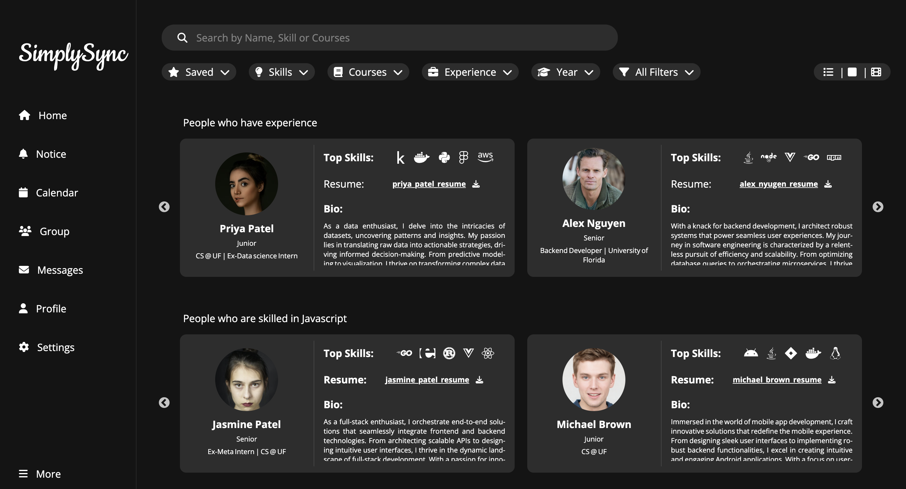

# SimplySync

SimplySync is a platform designed to tackle the challenges students encounter when finding suitable teammates for university projects. Traditional methods of team formation often lead to mismatched skill sets and lack of cohesion among team members, resulting in inefficiencies and suboptimal project outcomes. In response to these issues, SimplySync aims to streamline and enhance the team formation process for students, enabling meaningful connections among like-minded collaborators.

## Research Study:
Research study focuses on investigating the impact of different search interaction models on user experience, efficiency, and performance in the context of forming project teams for university courses. The study compares three search interfaces: list-based, card-based, and carousel-based, designed to help students find suitable teammates for collaborative projects.

## Search User Interfaces:
  *List View:*

  
 
  *Card View:*

  
  
  *Carousel View:*
  

## Demo: 
You can access the complete demo [here](https://drive.google.com/file/d/18NIxru5YE-B8uP2l3li9aTtzWWfyOzBM/view?usp=drive_link).

## Installation:
1. Clone the repository: https://github.com/Sheel-ui/SimplySync.git
2. Install dependencies: ```npm install```
3. Start the development server: ```npm start```

## Data:
Real data of the users who participated in the study is not included in this repository, but we have added some sample data.

## Overview of the Complete Solution:

The platform simplifies team creation by offering core functionalities such as:

- *Home:* Featuring user posts and suggested collaborators, this page serves as a central hub for project advertisements and team formation.

- *Profile:* A comprehensive user profile page with easy editing capabilities, providing detailed information about each user.

- *Chats:* A messaging platform for direct communication, facilitating easy collaboration and project coordination.

- *Search:* An exploration feature that allows users to search for potential project partners based on various criteria.

## Proposed Wireframes

Below are wireframes for key sections of the project:

#### Landing Page


#### Home Page


#### Profile Page


#### Chats Page


#### Search Page


Feel free to explore the visual representation of our project's design and structure.